## 🌐 Live Demo

🔗 https://readium-5uwq.onrender.com

# 📚 Readium — Your Personal Knowledge Engine

> A system for readers who want to retain, connect, and apply what they learn.

Readium transforms passive reading into active thinking.
Track your books, capture insights, and build a system where ideas compound over time.

---

```md
---

## 💡 Why Readium?

Most reading apps focus on tracking books — not understanding them.

Readium was built to solve a deeper problem:
> reading without retention.

It helps you capture insights, connect ideas, and turn reading into a system for thinking.

---

## 🚀 Features

### 📖 Book Management

* Add books manually or fetch using Google Books API
* Store metadata: title, author, rating, cover, pages
* Clean and minimal UI for browsing your library

### 🧠 AI-Driven Insights

* Contextual summaries generated per book
* Key insights extracted for faster recall
* Designed to feel natural, not robotic

### ✍️ Notes & Reflection System

* Add notes linked to specific books
* View recent musings and reflections
* Build a personal knowledge base

### 📊 Dashboard (Curated Insights)

* Total books tracked
* Average rating across your library
* Reading velocity (last 90 days)
* Currently reading (auto-detected)
* Knowledge Graph (books + ideas connected)

### 🔍 Smart Search

* Fetch books using Google Books API
* Auto-fill book details while adding

---

## 🧱 Tech Stack

| Layer    | Tech                 |
| -------- | -------------------- |
| Backend  | Node.js, Express     |
| Database | PostgreSQL           |
| Frontend | EJS, CSS (custom UI) |
| APIs     | Google Books API     |
| Styling  | Custom design system |

---
## 🚀 Deployment

- Backend hosted on Render  
- Database powered by Neon (PostgreSQL)  

---

## 🗂️ Project Structure

```bash
Readium/
│
├── routes/          # Express routes
├── views/           # EJS templates
├── public/
│   ├── stylesheets/ # CSS files
│   └── images/
├── database/        # DB connection
├── .env             # API keys
└── app.js
```

---

## ⚙️ Setup Instructions

### 1. Clone the repo

```bash
git clone https://github.com/suyashsinghx/Readium
cd readium
```

### 2. Install dependencies

```bash
npm install
```

## 3. Environment Variables

Create a `.env` file with:

```env
DATABASE_URL=your_postgres_connection
SESSION_SECRET=your_secret_key
GOOGLE_CLIENT_ID=your_google_client_id
GOOGLE_CLIENT_SECRET=your_google_client_secret
GOOGLE_CALLBACK_URL=your_callback_url
API_KEY=your_google_books_api_key

---

### 4. Setup Database (PostgreSQL)

Create tables:

```sql
CREATE TABLE users (
  id SERIAL PRIMARY KEY,
  name TEXT,
  email TEXT UNIQUE,
  password TEXT,
  google_id TEXT,
  avatar TEXT,
  bio TEXT
);

CREATE TABLE books (
  id SERIAL PRIMARY KEY,
  title TEXT NOT NULL,
  author TEXT NOT NULL,
  rating FLOAT,
  cover_url TEXT,
  pages INT,
  tags TEXT,
  notes TEXT,
  ai_summary TEXT,
  ai_insight TEXT,
  user_id INT REFERENCES users(id),
  created_at TIMESTAMP DEFAULT CURRENT_TIMESTAMP
);

CREATE TABLE notes (
  id SERIAL PRIMARY KEY,
  book_id INT REFERENCES books(id) ON DELETE CASCADE,
  title TEXT,
  content TEXT,
  page INT,
  user_id INT REFERENCES users(id),
  date TIMESTAMP DEFAULT CURRENT_TIMESTAMP
);
```

---

### 5. Run the app

```bash
npm start
```

Open:

```
http://localhost:3000
```

---

## 🎯 Key Concepts Behind Readium

* Reading → Thinking → Applying
* Focus on retention, not consumption
* Build a second brain through notes and connections
* Minimal UI to reduce cognitive noise

---

## 📸 Screenshots

### Dashboard
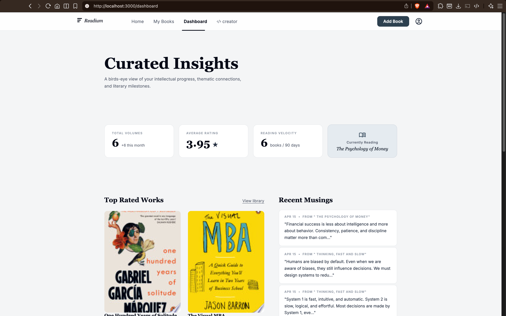

### Book Detail
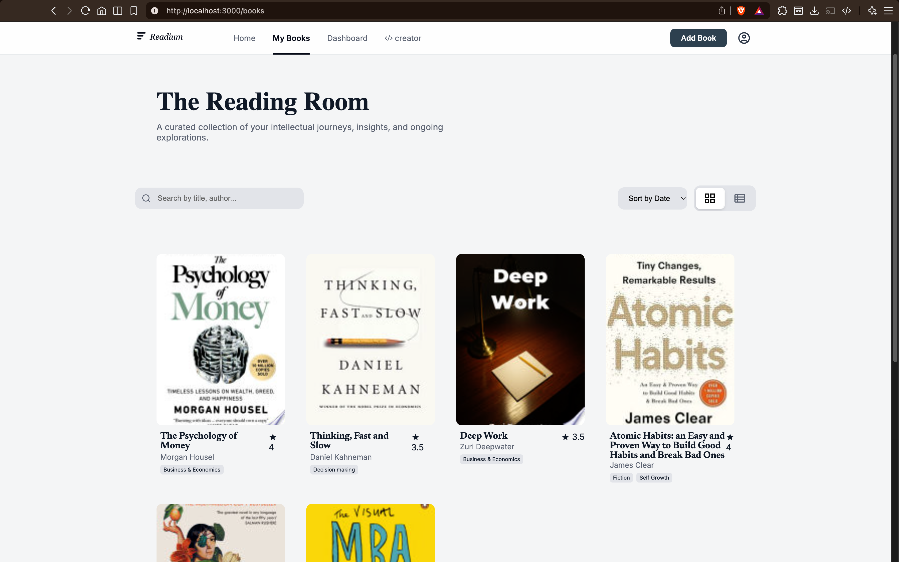

### Add Books
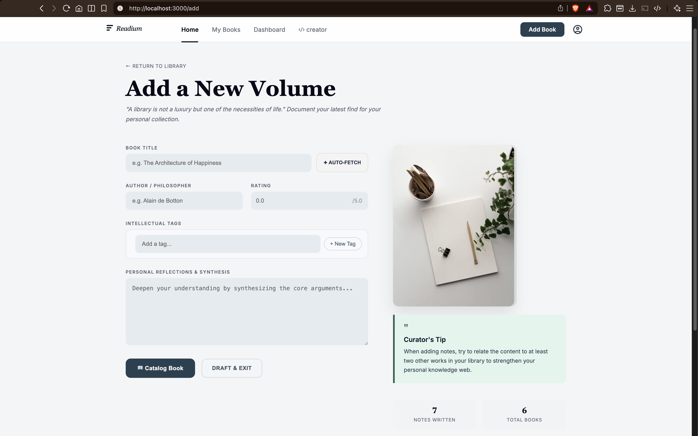

### About Creator
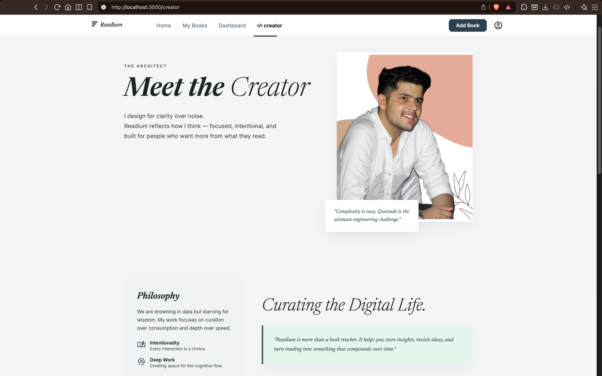

### Features Updated
<table>
  <tr>
    <td align="center">
      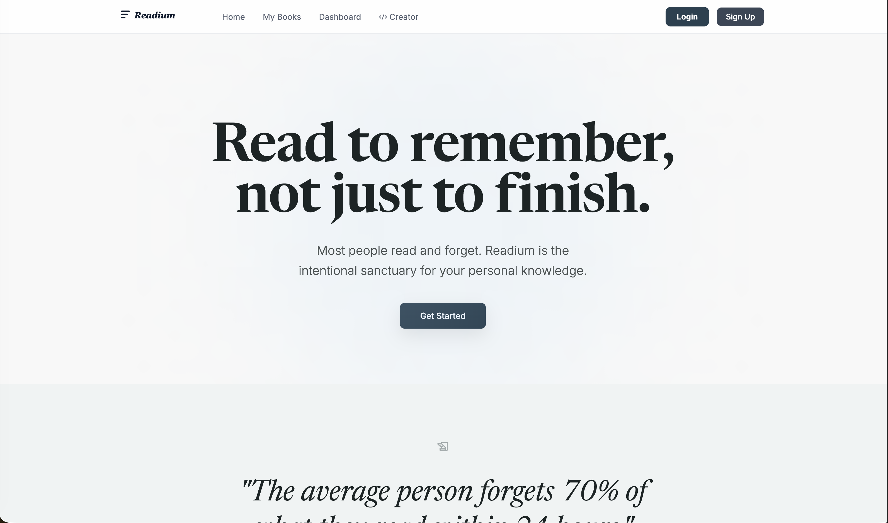<br>
      <b>Public Page Readium</b>
    </td>
    <td align="center">
      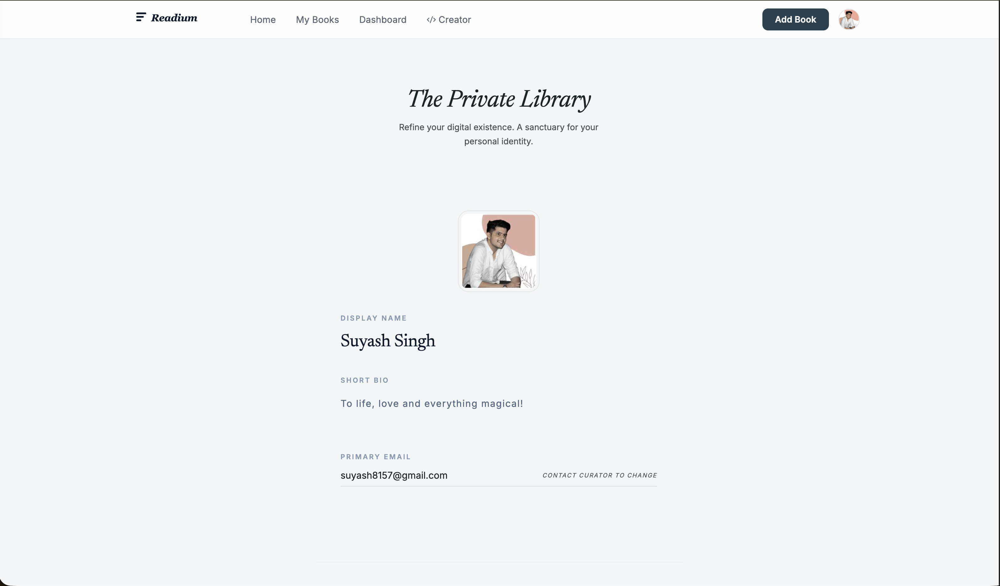<br>
      <b>User Account Sec. Readium</b>
    </td>
  </tr>

  <tr>
    <td align="center">
      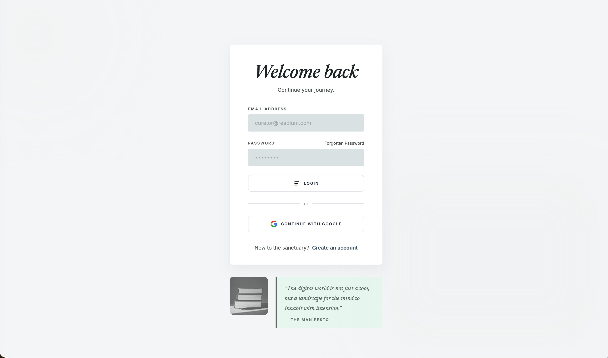<br>
      <b>Login Page Readium</b>
    </td>
    <td align="center">
      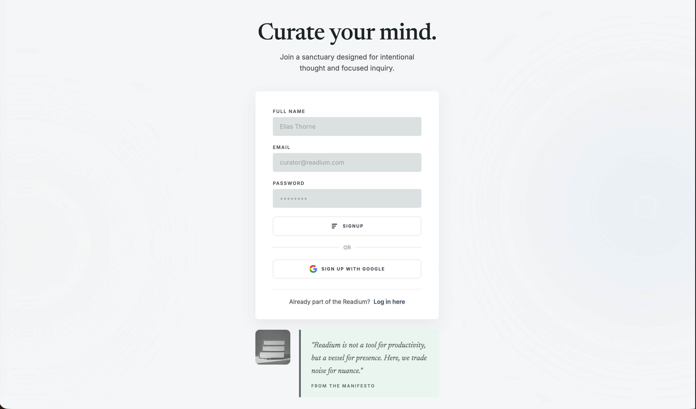<br>
      <b>Signup Page Readium</b>
    </td>
  </tr>

  <tr>
    <td align="center">
      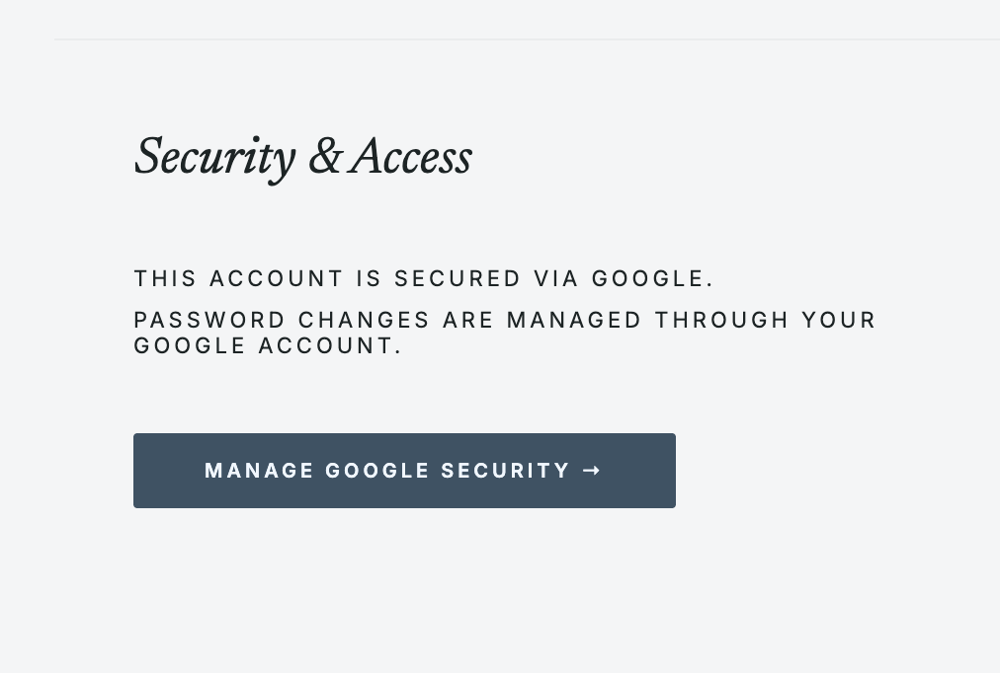<br>
      <b>Google OAuth User Security Access</b>
    </td>
    <td align="center">
      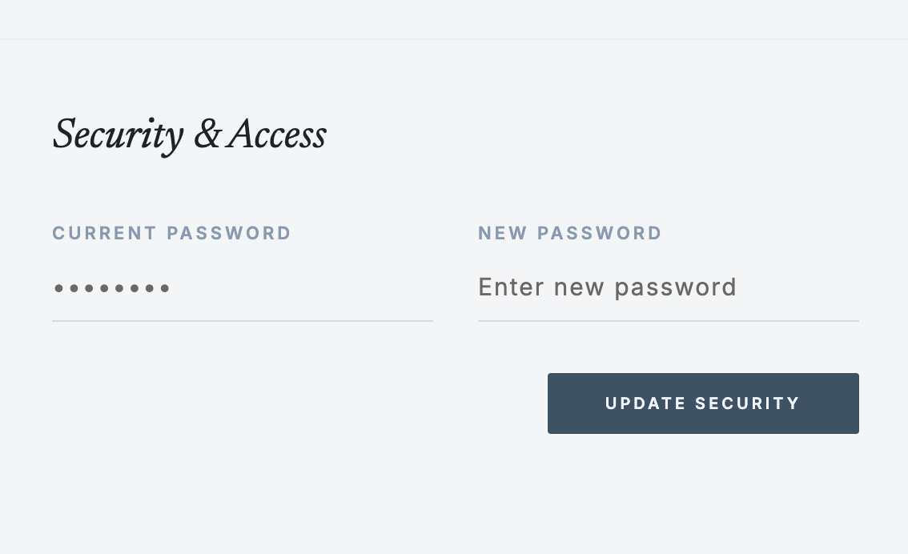<br>
      <b>Local Method Security Access</b>
    </td>
  </tr>

  <tr>
    <td align="center">
      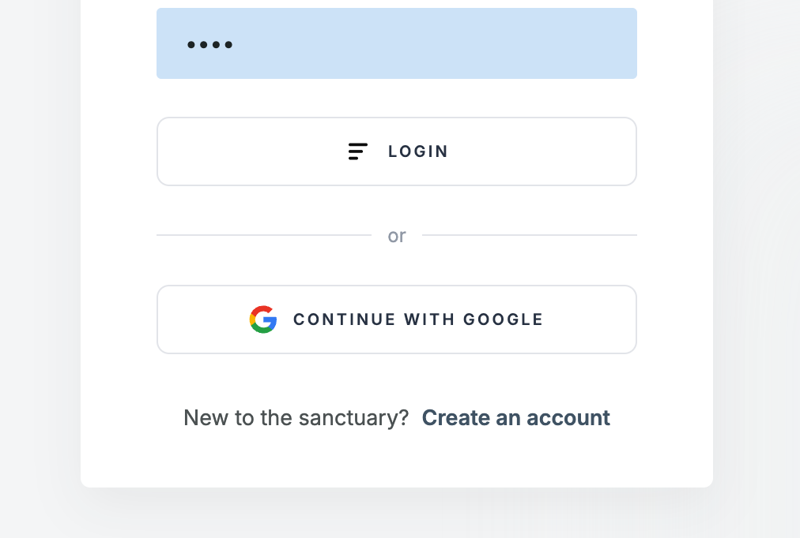<br>
      <b>Login|Signup Methods</b>
    </td>
    <td align="center">
      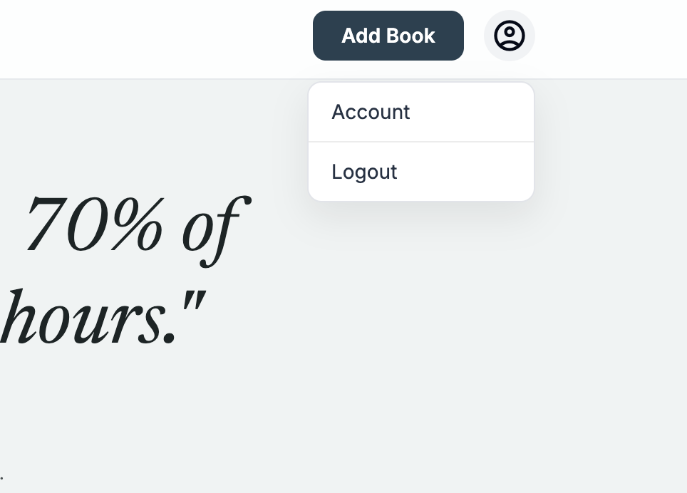<br>
      <b>Drop Down Logout</b>
    </td>
  </tr>
</table>

---

## 🧠 Future Improvements

* Knowledge graph visualization (nodes & connections)
* AI-powered note linking
* Tag-based filtering system
* User authentication
* Dark mode support

---

## 🔐 Authentication & User System

- Secure authentication using Passport.js
- Local strategy (email + password login)
- Google OAuth 2.0 login integration
- Session-based authentication with Express Session
- User-specific data isolation (each user sees only their books & notes)

---

## 👤 User Profile Features

- Editable display name and bio
- Profile avatar upload (compressed using Sharp)
- Inline editing UX (click-to-edit fields)
- Secure password update system (for local users)
- Google users handled separately (no password conflicts)

---

## 🧩 System Enhancements in This Version

- Added full authentication system (local + Google)
- Protected routes using `ensureAuth` middleware
- Linked books and notes to users using `user_id`
- Implemented dynamic navbar based on auth state
- Improved dashboard with real user-based data
- Added fallback UI for new users (empty state handling)
- Integrated Google Books API for dynamic suggestions
- Added profile management system (avatar, bio, name)
- Optimized image uploads using Sharp compression
- Refactored database queries to be user-specific
- Improved UX with conditional rendering (logged in vs guest)

---

## 👨‍💻 Creator

Built for clarity in a noisy digital world.
Designed to help you think deeper, not just read more.

---

## 📬 Connect

* LinkedIn: https://www.linkedin.com/in/suyashsingh04/
* Instagram: https://www.instagram.com/suyashsinghx/

---

## 📄 License

MIT License
