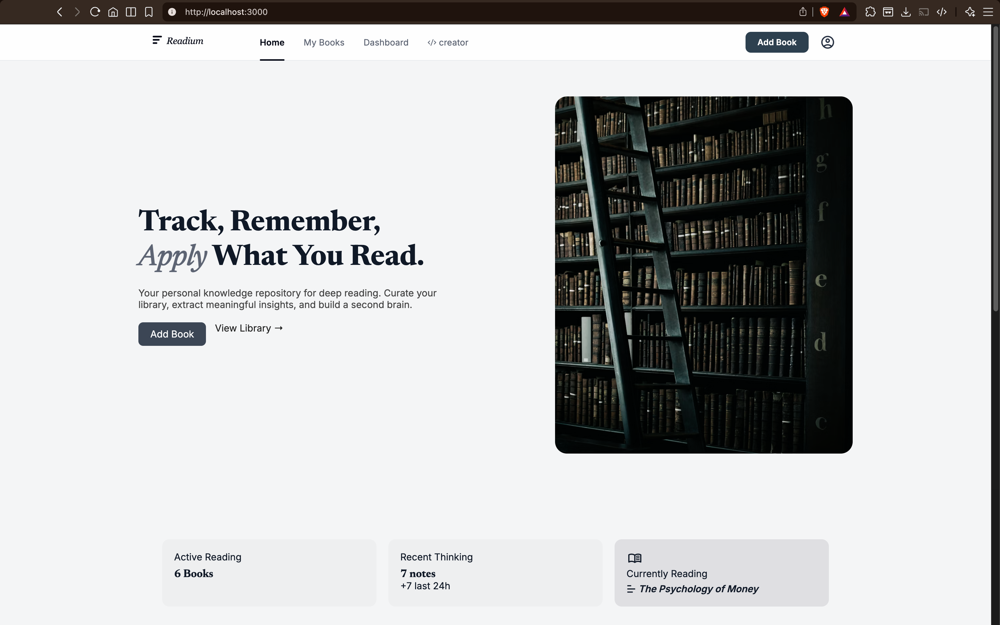

## 🌐 Live Demo

🔗 https://readium-5uwq.onrender.com

# 📚 Readium — Your Personal Knowledge Engine

> Built for readers who think, not just consume.

Readium transforms passive reading into active thinking.
Track your books, capture insights, and build a system where ideas compound over time.

---

## 🚀 Features

### 📖 Book Management

* Add books manually or fetch using Google Books API
* Store metadata: title, author, rating, cover, pages
* Clean and minimal UI for browsing your library

### 🧠 AI-Driven Insights

* Contextual summaries generated per book
* Key insights extracted for faster recall
* Designed to feel natural, not robotic

### ✍️ Notes & Reflection System

* Add notes linked to specific books
* View recent musings and reflections
* Build a personal knowledge base

### 📊 Dashboard (Curated Insights)

* Total books tracked
* Average rating across your library
* Reading velocity (last 90 days)
* Currently reading (auto-detected)
* Knowledge Graph (books + ideas connected)

### 🔍 Smart Search

* Fetch books using Google Books API
* Auto-fill book details while adding

---

## 🧱 Tech Stack

| Layer    | Tech                 |
| -------- | -------------------- |
| Backend  | Node.js, Express     |
| Database | PostgreSQL           |
| Frontend | EJS, CSS (custom UI) |
| APIs     | Google Books API     |
| Styling  | Custom design system |

---
## 🚀 Deployment

- Backend hosted on Render  
- Database powered by Neon (PostgreSQL)  

---

## 🗂️ Project Structure

```
Readium/
│
├── routes/          # Express routes
├── views/           # EJS templates
├── public/
│   ├── stylesheets/ # CSS files
│   └── images/
├── database/        # DB connection
├── .env             # API keys
└── app.js
```

---

## ⚙️ Setup Instructions

### 1. Clone the repo

```bash
git clone https://github.com/yourusername/readium.git
cd readium
```

### 2. Install dependencies

```bash
npm install
```

### 3. Setup `.env`

Create a `.env` file:

```env
API_KEY=your_google_books_api_key
```

---

### 4. Setup Database (PostgreSQL)

Create tables:

```sql
CREATE TABLE books (
  id SERIAL PRIMARY KEY,
  title TEXT NOT NULL,
  author TEXT NOT NULL,
  rating FLOAT,
  cover_url TEXT,
  pages INT,
  tags TEXT,
  notes TEXT,
  ai_summary TEXT,
  ai_insight TEXT,
  date TIMESTAMP DEFAULT CURRENT_TIMESTAMP
);

CREATE TABLE notes (
  id SERIAL PRIMARY KEY,
  book_id INT REFERENCES books(id) ON DELETE CASCADE,
  title TEXT,
  content TEXT,
  page INT,
  date TIMESTAMP DEFAULT CURRENT_TIMESTAMP
);
```

---

### 5. Run the app

```bash
npm start
```

Open:

```
http://localhost:3000
```

---

## 🎯 Key Concepts Behind Readium

* Reading → Thinking → Applying
* Focus on retention, not consumption
* Build a second brain through notes and connections
* Minimal UI to reduce cognitive noise

---

## 📸 Screenshots

### Home


### Dashboard


### Book Detail


### Add Books


### About Creator

---

## 🧠 Future Improvements

* Knowledge graph visualization (nodes & connections)
* AI-powered note linking
* Tag-based filtering system
* User authentication
* Dark mode support

---

## 👨‍💻 Creator

Built for clarity in a noisy digital world.
Designed to help you think deeper, not just read more.

---

## 📬 Connect

* LinkedIn: https://www.linkedin.com/in/suyashsingh04/
* Instagram: https://www.instagram.com/suyashsinghx/

---

## 📄 License

MIT License
